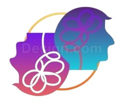

  
  <h1 align="center">#  **OraMind – AI Voice Agent** </h1>

> **Speak. Learn. Grow.**  
> A powerful voice-based AI assistant built with modern technologies to enhance your skills, learn deeply, and get instant feedback with real-time conversation.

---

## 🔥 Live Demo

🧠 Talk to AI, get feedback, and level up your communication!

---

## 🛠️ Tech Stack

| Technology                                  | Role/Usage                                      |
|--------------------------------------------|--------------------------------------------------|
|  | Full-stack framework                         |
|  | Styling and responsiveness                   |
|  | Serverless DB & Realtime Functions           |
|  | Real-time Speech-to-Text                     |
|  | AI-generated voice responses (Text-to-Speech)|
|  | AI chat assistant using GPT models           |
|   | UI interactivity and animation              |
|  | Feedback notifications                       |
|    | Core front-end |

---

## 🚀 Features

### 🎧 Real-Time Voice Conversation
- Users can **speak to the AI**, and the app uses **Google Speech-to-Text** to transcribe it.
- AI replies using **OpenAI (via OpenRouter)** with intelligent conversation flow.
- Voice output is played back using **Amazon Polly** (Text-to-Speech).

### 🤖 AI Coaching & Chat
- Choose an **expert avatar** based on topic or style.
- Get real-time responses and **AI-generated coaching**.

### 📝 Summary & Feedback Generation
- After conversation ends, generate **smart summaries** and **personalized feedback**.
- Feedback includes chat review, suggestions, and learning tips.

### 👤 Profile Management
- Upload profile photo, view user info.
- Data is synced with **Convex.dev database**.

### 🔒 Authentication
- Secure sign-up/sign-in.
- Sessions are stored locally for persistent login.

---

## 🎯 Future Improvements

- 🎤 Multi-language support
- 🗓️ Schedule coaching sessions
- 📱 Mobile-first PWA

---

## ✨ Thank You

> OraMind is built with ❤️ to help you grow, communicate confidently, and reflect on your conversations.

Feel free to ⭐ the repo if you found this helpful!

---

This is a [Next.js](https://nextjs.org) project bootstrapped with [`create-next-app`](https://github.com/vercel/next.js/tree/canary/packages/create-next-app).

## 🚦 How to Run Locally

### 🔧 1. Clone the Repository

git clone https://github.com/your-username/oramind-ai-app.git
cd oramind-ai-app

### 💻 2. Install Dependencies
npm install

### ▶️ 3. Run the Frontend
npm run dev

### 🧠 4. Run Convex (Backend)
npx convex dev

### ⚙️ 3. Set up Environment Variables
Create a .env.local file and add your keys:

NEXT_PUBLIC_CONVEX_URL=https://your-convex-instance.convex.cloud
NEXT_PUBLIC_OPENAI_API_KEY=your-openai-key
NEXT_PUBLIC_POLLY_REGION=your-region
NEXT_PUBLIC_POLLY_ACCESS_KEY=your-access-key
NEXT_PUBLIC_POLLY_SECRET_KEY=your-secret
NEXT_PUBLIC_GOOGLE_STT_API_KEY=your-google-key
